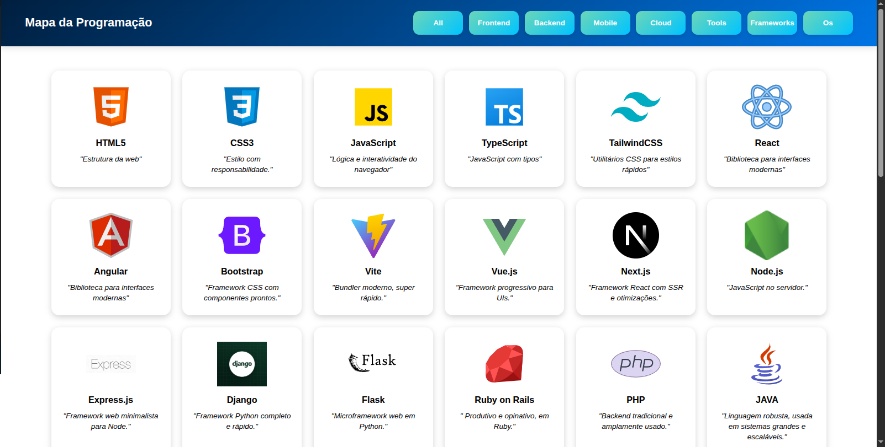
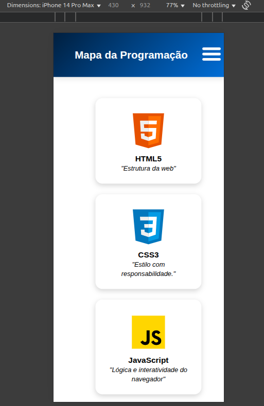
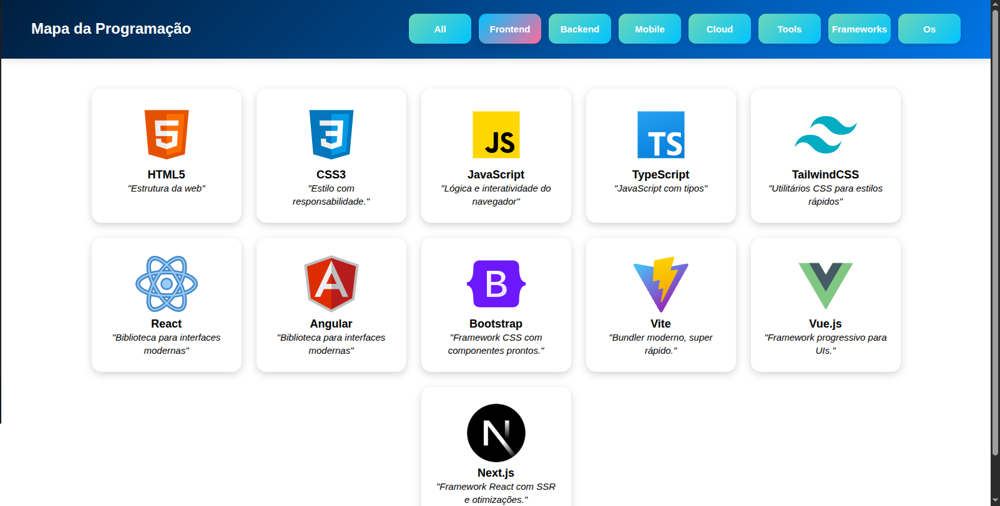

# 🗺️ Mapa da Programação

Um projeto visual e interativo desenvolvido com **HTML**, **CSS** e **JavaScript** que apresenta uma visão geral das principais tecnologias utilizadas no desenvolvimento web. Ideal para iniciantes que desejam entender as diferentes linguagens, bibliotecas e frameworks, ou para profissionais que querem uma visão organizada das ferramentas disponíveis.

## 📌 Funcionalidades

- Interface amigável e responsiva
- Ícones representativos para cada tecnologia
- Breves descrições para fácil entendimento
- Classificação por categorias (Frontend, Backend, Mobile, Cloud, etc.)
- Filtro de tecnologias por tipo através de botões no topo

## 🛠️ Tecnologias Utilizadas

- **HTML5** – Estruturação do conteúdo
- **CSS3** – Estilização visual
- **JavaScript** – Interatividade e lógica de filtragem

## 📷 Captura de Tela



## 🚀 Como Executar

1. Clone o repositório:
   ```bash
   git clone https://github.com/seu-usuario/mapa-da-programacao.git
   ```
2. Acesse a pasta do projeto:
    ``` bash
    cd mapa-da-programacao
    ```
3. Abra o arquivo index.html em seu navegador preferido 


## 🎯 Lógica de Filtragem e Interação

O projeto utiliza **JavaScript puro** para tornar a interface dinâmica e responsiva. Abaixo estão as principais funcionalidades implementadas:

### ✅ Filtragem de Cards por Categoria

Os botões de categorias (como `Frontend`, `Backend`, `Mobile`, etc.) filtram os cards com base na classe associada a cada card.

```js
const botao = document.querySelectorAll(".botao");

botao.forEach(botao => {
    botao.addEventListener("click", function () {
        const categoria = botao.textContent.toLowerCase();
        const todosCard = document.querySelectorAll(".cards");

        todosCard.forEach(card => {
            if (categoria === "all") {
                card.style.display = "block";
            } else if (card.classList.contains(categoria)) {
                card.style.display = "block";
            } else {
                card.style.display = "none";
            }
        });
    });
});
```

## 📱 Menu Responsivo para Telas Pequenas

Em dispositivos com largura inferior a 800px, o menu de categorias pode ser exibido ou ocultado clicando no botão de menu.
``` js 
const botaoMenu = document.querySelector(".menu-toogle");
const menu = document.querySelector(".menu-container");

botaoMenu.addEventListener("click", function () {
    if (window.innerWidth <= 800) {
        if (menu.style.display === "block") {
            menu.style.display = "none";
        } else {
            menu.style.display = "block";
        }
    }
});
```




## 🎨 Destaque do Botão Selecionado
Ao clicar em um botão de categoria, ele recebe a classe .selecionado para destacar visualmente a opção ativa.
``` js
const botoes = document.querySelectorAll(".botao");

botoes.forEach(botao => {
    botao.addEventListener("click", () => {
        botoes.forEach(b => b.classList.remove("selecionado"));
        botao.classList.add("selecionado");
    });
});

```

